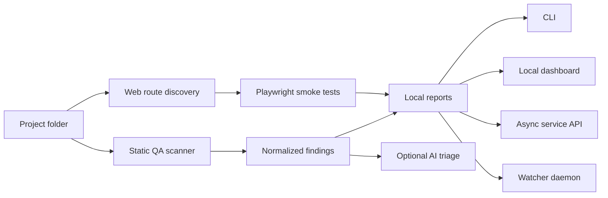

<div align="center">

# Sentinel QA Agent

**A local AI-powered QA command center for code, security, and web-app smoke testing.**

Run it as a CLI, a lightweight local dashboard, an async local service, or a background watcher. Sentinel helps a solo builder scan downloaded repositories without silently executing their code on the host.

[](https://github.com/Ujjwaldhariwal/sentinel-qa-agent/actions)
[](#version)
[](https://www.python.org/)
[](LICENSE)
[](https://github.com/Ujjwaldhariwal/sentinel-qa-agent/commits/agent/qa-ui-hardening)

</div>

---

## What Is This?

Sentinel QA Agent is an R&D-stage QA automation tool that runs over your projects and looks for:

- security risks such as secrets, unsafe browser sinks, weak crypto, and dangerous execution
- likely bugs and bad engineering signals
- dependency and ecosystem audit failures when tools are installed
- missing QA basics such as tests and CI
- live web-app failures such as blank screens, console errors, bad routes, failed network calls, and broken click paths

The important idea: **deterministic scanners collect evidence first, AI reviews the evidence second.** That keeps the tool grounded, repeatable, and easier to trust.

## Version

Current development line: **v0.4.0-alpha**

This branch includes the layman-friendly dashboard, safer async scan flow, folder browser, readiness doctor, smarter project detection, richer reports, cleaner scanner heuristics, CI, and stale-server error handling.

| Channel | State |
| --- | --- |
| `main` | Initial published release |
| `agent/qa-ui-hardening` | Active v0.4.0-alpha preview |
| PR #1 | Draft review branch with CI passing |

## Product Snapshot



Sentinel is designed to become a small personal QA operator: local-first, quiet by default, and strong enough to sit across many projects.

## Core Features

| Area | What Sentinel Does Today |
| --- | --- |
| **Static QA** | Scans source files for risky patterns, leaked credentials, weak hashes, browser XSS sinks, debug statements, dangerous execution, and suspicious SQL. |
| **Dependency Checks** | Uses `npm audit`, `pip-audit`, `bandit`, `semgrep`, `gosec`, and `cargo audit` when those tools exist locally, routed through Docker sandboxing by default. |
| **Web QA** | Uses Playwright to load pages, detect blank screens, collect console/page errors, flag failed requests, capture screenshots, and test configured clicks. |
| **Route Discovery** | Finds common Next.js, Pages Router, and static HTML routes from project structure. |
| **AI Review** | Optional provider-key triage that reviews redacted findings and treats repository text as untrusted evidence. |
| **Local Dashboard** | Minimal UI for selecting a project folder, checking local readiness, running QA, filtering findings, and opening reports. |
| **Async Agent API** | Queue scans, poll jobs, fetch run history, read logs, and integrate with a modal, extension, editor, or automation. |
| **Continuous Watcher** | Watches a folder and scans again after changes. |
| **Doctor Checks** | Verifies Python, Docker, scanner image, local state, optional AI keys, and Web QA tooling before a user wastes time debugging setup. |
| **Generated Test Cases** | Builds a QA test-case plan from project signals and findings, then writes `test_cases.md` and `test_cases.json` beside every report. |

## Quick Start

Requirements:

- Python 3.11 or newer
- Docker Desktop for sandboxed optional tools and project test runners

```bash
git clone https://github.com/Ujjwaldhariwal/sentinel-qa-agent.git
cd sentinel-qa-agent

python3 -m venv .venv
source .venv/bin/activate
make setup
```

Sentinel uses `--pull never` for sandbox containers. If this image is missing, sandboxed scans fail closed instead of pulling an unexpected image.

Check local readiness any time:

```bash
sentinel-qa --doctor
```

Machine-readable doctor output:

```bash
sentinel-qa --doctor --doctor-json
```

Run a basic project scan:

```bash
sentinel-qa /path/to/project --output-dir ./sentinel-report
```

Run only deterministic static checks without ecosystem tools:

```bash
sentinel-qa /path/to/project \
  --skip-optional-tools \
  --output-dir ./sentinel-report
```

Run a scan directly from the repository without installing:

```bash
python3 sentinel_qa.py /path/to/project --output-dir ./sentinel-report
```

Reports are written as:

- `report.md` for humans
- `report.json` for tools and automation
- `test_cases.md` for generated QA test-case specs
- `test_cases.json` for tool-readable test-case specs

Reports include severity totals, top-risk next steps, category counts, detected languages/frameworks, test signals, CI signals, and normalized findings.

Generated test cases are currently planned QA specs, not full auto-patches into your app. Existing project test commands still run through the Docker sandbox when optional tools are enabled. Stack-specific executable test generation is the next layer.

## Sandbox Mode

Sentinel treats downloaded repositories as untrusted. Optional ecosystem commands that touch repo content run through `sandbox_runner.py` in ephemeral Docker containers:

- one disposable container per tool command
- `--network none` by default
- read-only root filesystem
- repository mounted read-only
- writable `/tmp` and dedicated output mount only
- non-root user
- Linux capabilities dropped
- CPU, memory, memory-swap, and process-count limits
- host-side watchdog that kills overlong containers
- no host environment or AI provider key passed into the container

Network access is opt-in:

```bash
sentinel-qa /path/to/project --allow-network
```

Default offline sandbox mode skips network-dependent audits such as `npm audit`, `pip-audit`, registry-backed Semgrep rules, and `cargo audit`. Local checks such as `npm test`, `bandit`, `go test`, and `cargo test` still run in containers when the matching project files exist.

Running repo tools directly on the host requires an explicit double opt-out:

```bash
sentinel-qa /path/to/project --no-sandbox --confirm-no-sandbox
```

That mode prints a warning every run. Use it only when you trust the repository.

Host-side static traversal is also bounded:

- max files per discovery/scan phase: `50000`
- max directory depth: `40`
- max text file bytes read: `2000000`
- max static traversal time: `300` seconds

Tune these only for repositories you trust:

```bash
sentinel-qa /path/to/project \
  --max-files 100000 \
  --max-depth 60 \
  --max-scan-seconds 600
```

## Dashboard Mode

Start the local service:

```bash
python3 sentinel_agent_server.py --host 127.0.0.1 --port 8765 --no-auth
```

Open:

```text
http://127.0.0.1:8765
```

The dashboard is built for a simple flow:

1. Pick a project folder.
2. Click **Run QA**.
3. Read severity counts.
4. Open the Markdown or JSON report.

> [!TIP]
> If the UI says the local server returned HTML instead of JSON, restart the Python server. That means the browser has newer UI code but the backend process is still an older version.

## AI Review

AI review is opt-in.

OpenAI:

```bash
export OPENAI_API_KEY="your_api_key"

sentinel-qa /path/to/project \
  --ai-review \
  --ai-provider openai \
  --model gpt-5.4-mini \
  --output-dir ./sentinel-report
```

Anthropic:

```bash
export ANTHROPIC_API_KEY="your_api_key"

sentinel-qa /path/to/project \
  --ai-review \
  --ai-provider anthropic \
  --model claude-3-5-sonnet-latest \
  --output-dir ./sentinel-report
```

AI output is written to:

- `ai_review.md`
- `ai_review.json`

Sentinel redacts secret-like values before AI review. The LLM sees normalized findings and limited evidence, not a blind dump of your whole repository.

Repository snippets, comments, README text, and config values are treated as untrusted content in the AI prompt. Prompt-injection attempts can still appear inside the evidence sent for review, but the system prompt tells the model not to follow repository-provided instructions, not to weaken security recommendations, and never to ask for or expose local secrets. AI review now fails closed if the model response is not valid JSON with the expected review fields.

## Web QA

Test a running app:

```bash
sentinel-web-qa http://localhost:3000 \
  --route / \
  --route /login \
  --route /dashboard \
  --viewport desktop \
  --output-dir ./web-report
```

Test a click path:

```bash
sentinel-web-qa http://localhost:3000 \
  --click 'button[type="submit"]' \
  --viewport mobile \
  --output-dir ./web-report
```

Combine source scan and web QA:

```bash
sentinel-qa /path/to/project \
  --web-url http://localhost:3000 \
  --web-discover-routes \
  --output-dir ./full-report
```

## Async Service API

Create a token-backed config:

```bash
python3 sentinel_agent_server.py --init-config --config ./sentinel.config.json
```

Start the service:

```bash
python3 sentinel_agent_server.py --config ./sentinel.config.json
```

Queue a scan:

```bash
curl -X POST http://127.0.0.1:8765/scan-async \
  -H "Authorization: Bearer YOUR_TOKEN" \
  -H "Content-Type: application/json" \
  -d '{
    "root": "/path/to/project",
    "ai_review": false,
    "web_url": "http://localhost:3000",
    "web_routes": ["/", "/login"]
  }'
```

Poll a job:

```bash
curl -H "Authorization: Bearer YOUR_TOKEN" \
  "http://127.0.0.1:8765/job?id=JOB_ID"
```

## Continuous Mode

Run Sentinel as a watcher:

```bash
python3 sentinel_daemon.py ~/projects \
  --interval 60 \
  --run-now \
  --ai-review
```

It fingerprints relevant files, scans when they change, writes timestamped reports, and records local history.

## Project Policy

Add `sentinel.policy.json` to a project root:

```json
{
  "scan": {
    "exclude_dirs": [".generated"],
    "exclude_globs": ["fixtures/**"],
    "max_files": 50000,
    "max_depth": 40,
    "max_file_bytes": 2000000,
    "max_scan_seconds": 300
  },
  "ai": {
    "enabled": true,
    "model": "gpt-5.4-mini"
  },
  "web": {
    "base_url": "http://localhost:3000",
    "routes": ["/", "/login"],
    "discover_routes": true,
    "viewport": "desktop"
  },
  "quality_gate": {
    "fail_on": ["critical", "high"]
  }
}
```

See:

- [`sentinel.policy.example.json`](sentinel.policy.example.json)
- [`sentinel.config.example.json`](sentinel.config.example.json)

## Security Model

- Local-first by default.
- Not a hosted multi-tenant service.
- Users bring their own AI provider key.
- Optional repo code execution is Docker-sandboxed by default.
- Docker containers do not receive `OPENAI_API_KEY`, Anthropic keys, or other host environment variables.
- Sandboxed containers run with no network unless `--allow-network` is passed.
- Token auth enabled by default for the service config.
- Token-protected service routes fail closed if token auth is enabled but no token is configured.
- AI review disabled unless explicitly enabled.
- Secret-like values are redacted before AI calls.
- Reports, job history, and logs stay local unless you move them.
- Service should stay bound to `127.0.0.1` unless you add proper network controls.

Sentinel is a QA accelerator, not a replacement for professional penetration testing, threat modeling, or human code review.

## R&D Tracks

This is where Sentinel can become genuinely strong.

| Track | Crazy-Level Direction |
| --- | --- |
| **Project Memory** | Build a per-project knowledge graph of routes, services, env vars, endpoints, migrations, test gaps, and recurring failures. |
| **Autonomous QA Plans** | Let the agent inspect a repo and generate a test plan before scanning: source checks, web flows, auth flows, API probes, and risk-ranked scenarios. |
| **PR Copilot** | Comment directly on GitHub PRs with findings, evidence, suggested patches, and test commands. |
| **Replayable Web Journeys** | Record user journeys once, replay them after every change, and compare screenshots, console logs, route behavior, and network health. |
| **Local Extension** | A tiny browser or editor extension that sends the current project/page to the local Sentinel service. |
| **Sandboxed Workers** | Expand Docker isolation from optional tool commands into a fuller scanner execution profile with prebuilt scanner images. |
| **Auto-Fix Mode** | Generate patches for low-risk issues, run tests, and open a PR with evidence. |
| **Risk Scoreboard** | Track risk by project over time: critical open issues, flaky routes, dependency risk, missing tests, and CI health. |
| **Local Fleet View** | Optional local index across your own cloned repos, devices, and reports without requiring a hosted control plane. |
| **Agent Marketplace** | Plugin hooks for custom scanners: Stripe, Supabase, Next.js, Django, FastAPI, mobile apps, infra, and API security. |

## Development

Common workflow:

```bash
make setup
make doctor
make scanner-image
make test
make smoke
```

Run tests:

```bash
make test
```

Compile modules:

```bash
make compile
```

Self-scan:

```bash
make self-scan
```

## Commands

| Command | Purpose |
| --- | --- |
| `sentinel-qa` | Scan one project or a directory of projects. |
| `sentinel-qa --doctor` | Check local setup readiness. |
| `sentinel-web-qa` | Run browser QA against a live app. |
| `sentinel-agent-server` | Start the local dashboard and API. |
| `sentinel-daemon` | Watch source trees and scan after changes. |

## Roadmap

- [x] Multi-project static scanning
- [x] Optional AI-assisted triage
- [x] Browser smoke tests
- [x] Route discovery
- [x] Async local service
- [x] Minimal dashboard
- [x] Folder browser
- [x] Local readiness doctor
- [x] Smarter project detection in reports
- [x] Filterable findings panel
- [x] Generated QA test-case plan in every report
- [x] CI and self-scan gate
- [x] Docker sandbox for optional repo tool execution
- [x] Prebuilt scanner image with pinned Semgrep/Bandit/pip-audit/npm tooling
- [ ] GitHub PR annotations
- [ ] Browser extension client
- [ ] Editor extension client
- [ ] Replayable web journeys
- [ ] Auto-fix branch mode
- [ ] Local multi-repo index and sync-friendly report format

## License

Released under the [MIT License](LICENSE).
