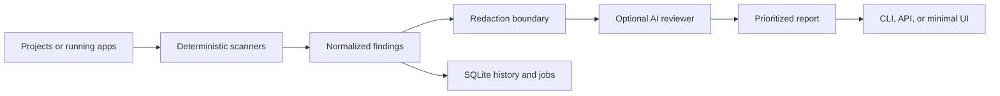

<div align="center">

# Sentinel QA

**An autonomous, AI-assisted QA and security agent for every project you ship.**

Scan source code, dependencies, tests, and running web apps from one quiet CLI or a lightweight local service.

[](https://www.python.org/)
[](LICENSE)
[](https://github.com/Ujjwaldhariwal/sentinel-qa-agent/actions/workflows/ci.yml)
[](#roadmap)

</div>

---

Sentinel QA combines deterministic scanners with an optional AI reviewer. The scanners collect evidence; the model prioritizes likely real defects, explains impact, filters noise, and proposes focused fixes and tests. Your code remains the source of truth, and secret-like values are redacted before model calls.

## Why Sentinel

| Capability | What it does |
| --- | --- |
| **Source analysis** | Finds leaked secrets, risky execution, XSS sinks, weak hashes, debug flags, and suspicious SQL construction. |
| **Dependency checks** | Uses `npm audit`, `pip-audit`, `Bandit`, `Semgrep`, `gosec`, and `cargo audit` when available. |
| **Test execution** | Runs ecosystem test commands and captures failures as actionable findings. |
| **Browser QA** | Uses Playwright to detect blank pages, console errors, failed requests, broken routes, and interaction failures. |
| **AI triage** | Reviews evidence for severity, exploitability, false-positive likelihood, fixes, and missing tests. |
| **Continuous mode** | Watches projects for changes and launches fresh scans automatically. |
| **Agent service** | Exposes authenticated sync and async APIs, persistent jobs, run history, logs, and a minimal web UI. |

## How It Works



Sentinel does not ask an LLM to blindly inspect an entire repository. It first gathers concrete evidence with reproducible checks, then sends only findings and small surrounding snippets for AI triage.

## Quick Start

Requirements: Python 3.11 or newer.

```bash
git clone <your-repository-url>
cd sentinel-qa-agent

python3 -m venv .venv
source .venv/bin/activate
python -m pip install -e .
```

Scan one repository:

```bash
sentinel-qa /path/to/project --output-dir ./sentinel-report
```

Scan a folder containing many repositories:

```bash
sentinel-qa ~/projects --output-dir ./sentinel-report
```

The run creates machine-readable `report.json` and human-readable `report.md` files.

## AI Review

AI review is opt-in and requires an OpenAI API key:

```bash
export OPENAI_API_KEY="your_api_key"

sentinel-qa ~/projects \
  --ai-review \
  --model gpt-5.4-mini \
  --output-dir ./sentinel-report
```

The additional analysis is written to `ai_review.md`. Secret-like values are removed before requests leave the machine.

## Web QA

Test a running web application:

```bash
sentinel-web-qa http://localhost:3000 \
  --route / \
  --route /login \
  --route /dashboard \
  --viewport desktop \
  --output-dir ./web-report
```

Exercise a critical control during the run:

```bash
sentinel-web-qa http://localhost:3000 \
  --click 'button[type="submit"]' \
  --viewport mobile
```

You can combine source and browser QA in one run:

```bash
sentinel-qa /path/to/project \
  --web-url http://localhost:3000 \
  --web-discover-routes \
  --output-dir ./full-report
```

## Agent Service

Generate a service configuration and random bearer token:

```bash
sentinel-agent-server --init-config --config ./sentinel.config.json
```

Start the service:

```bash
sentinel-agent-server --config ./sentinel.config.json
```

Open `http://127.0.0.1:8765` for the minimal dashboard, or trigger an asynchronous scan through the API:

```bash
curl -X POST http://127.0.0.1:8765/scan-async \
  -H "Authorization: Bearer YOUR_TOKEN" \
  -H "Content-Type: application/json" \
  -d '{
    "root": "/path/to/projects",
    "ai_review": true,
    "web_url": "http://localhost:3000",
    "web_routes": ["/", "/login"]
  }'
```

Inspect jobs and structured logs:

```bash
curl -H "Authorization: Bearer YOUR_TOKEN" \
  http://127.0.0.1:8765/jobs

curl -H "Authorization: Bearer YOUR_TOKEN" \
  "http://127.0.0.1:8765/logs?limit=50"
```

> [!IMPORTANT]
> Keep the service bound to `127.0.0.1` unless it is protected by HTTPS and network-level access controls. Do not expose a repository scanner directly to the public internet.

## Continuous Scanning

Run Sentinel as a lightweight watcher:

```bash
sentinel-daemon ~/projects \
  --interval 60 \
  --run-now \
  --ai-review
```

The daemon fingerprints relevant files, scans when they change, writes timestamped reports, and records each run in local SQLite history.

## Project Policy

Add `sentinel.policy.json` to a project root to keep its QA rules versioned with the code:

```json
{
  "scan": {
    "exclude_dirs": [".generated"],
    "exclude_globs": ["fixtures/**"]
  },
  "ai": {
    "enabled": true
  },
  "web": {
    "base_url": "http://localhost:3000",
    "routes": ["/", "/login"],
    "discover_routes": true,
    "viewport": "desktop"
  }
}
```

See [`sentinel.policy.example.json`](sentinel.policy.example.json) and [`sentinel.config.example.json`](sentinel.config.example.json) for complete examples.

## Commands

| Command | Purpose |
| --- | --- |
| `sentinel-qa` | Scan one project or a directory of projects. |
| `sentinel-web-qa` | Run browser-based QA against a live web app. |
| `sentinel-agent-server` | Start the authenticated local API and dashboard. |
| `sentinel-daemon` | Watch source trees and scan after changes. |

Run any command with `--help` to see all available options.

## Security Model

- AI review is disabled unless explicitly enabled.
- Only normalized findings and small source snippets are sent for model review.
- Secret-looking values are redacted before AI requests.
- Service endpoints require a generated token by default.
- Scan history, jobs, and logs are stored locally.
- Project paths and report directories remain under your control.

Sentinel is a force multiplier, not a replacement for threat modeling, human review, or a professional penetration test.

## Development

Run the test suite:

```bash
python -m unittest discover -s tests -v
```

Check that every module compiles:

```bash
python -m py_compile *.py
```

The project intentionally keeps its core dependency-free. Optional scanners and Playwright can be installed only where they are needed.

## Roadmap

- [x] Multi-project static scanning
- [x] AI-assisted evidence triage
- [x] Browser smoke tests and route discovery
- [x] Authenticated async agent service
- [x] Persistent history, jobs, and structured logs
- [ ] Docker deployment and managed worker isolation
- [ ] GitHub pull-request annotations and CI integration
- [ ] Extension and editor clients
- [ ] Team roles, project registry, and centralized dashboard

## License

Released under the [MIT License](LICENSE).
