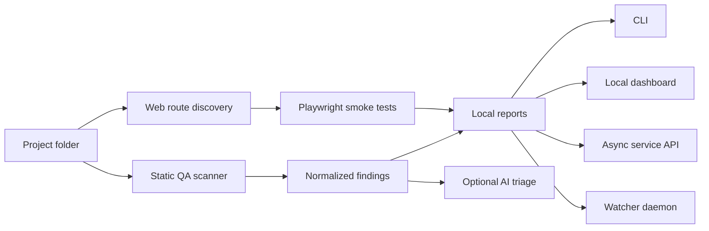

<div align="center">

# Sentinel QA Agent

**A local AI-powered QA command center for code, security, and web-app smoke testing.**

Run it as a CLI, a lightweight local dashboard, an async service, or a background watcher. Sentinel helps a solo builder or small team scan projects quickly, catch obvious flaws early, and turn findings into focused fixes.

[](https://github.com/Ujjwaldhariwal/sentinel-qa-agent/actions)
[](#version)
[](https://www.python.org/)
[](LICENSE)
[](https://github.com/Ujjwaldhariwal/sentinel-qa-agent/commits/agent/qa-ui-hardening)

</div>

---

## What Is This?

Sentinel QA Agent is an R&D-stage QA automation tool that runs over your projects and looks for:

- security risks such as secrets, unsafe browser sinks, weak crypto, and dangerous execution
- likely bugs and bad engineering signals
- dependency and ecosystem audit failures when tools are installed
- missing QA basics such as tests and CI
- live web-app failures such as blank screens, console errors, bad routes, failed network calls, and broken click paths

The important idea: **deterministic scanners collect evidence first, AI reviews the evidence second.** That keeps the tool grounded, repeatable, and easier to trust.

## Version

Current development line: **v0.4.0-alpha**

This branch includes the new layman-friendly dashboard, safer async scan flow, folder browser, report links, cleaner scanner heuristics, CI, and stale-server error handling.

| Channel | State |
| --- | --- |
| `main` | Initial published release |
| `agent/qa-ui-hardening` | Active v0.4.0-alpha preview |
| PR #1 | Draft review branch with CI passing |

## Product Snapshot



Sentinel is designed to become a small personal QA operator: local-first, quiet by default, and strong enough to sit across many projects.

## Core Features

| Area | What Sentinel Does Today |
| --- | --- |
| **Static QA** | Scans source files for risky patterns, leaked credentials, weak hashes, browser XSS sinks, debug statements, dangerous execution, and suspicious SQL. |
| **Dependency Checks** | Uses `npm audit`, `pip-audit`, `bandit`, `semgrep`, `gosec`, and `cargo audit` when those tools exist locally. |
| **Web QA** | Uses Playwright to load pages, detect blank screens, collect console/page errors, flag failed requests, capture screenshots, and test configured clicks. |
| **Route Discovery** | Finds common Next.js, Pages Router, and static HTML routes from project structure. |
| **AI Review** | Optional OpenAI-powered triage that explains impact, false-positive likelihood, likely fix, and missing tests. |
| **Local Dashboard** | Minimal UI for selecting a project folder, running QA, viewing severity counts, and opening reports. |
| **Async Agent API** | Queue scans, poll jobs, fetch run history, read logs, and integrate with a modal, extension, editor, or automation. |
| **Continuous Watcher** | Watches a folder and scans again after changes. |

## Quick Start

Requirements: Python 3.11 or newer.

```bash
git clone https://github.com/Ujjwaldhariwal/sentinel-qa-agent.git
cd sentinel-qa-agent

python3 -m venv .venv
source .venv/bin/activate
python -m pip install -e .
```

Run a basic project scan:

```bash
sentinel-qa /path/to/project --output-dir ./sentinel-report
```

Run a scan directly from the repository without installing:

```bash
python3 sentinel_qa.py /path/to/project --output-dir ./sentinel-report
```

Reports are written as:

- `report.md` for humans
- `report.json` for tools and automation

## Dashboard Mode

Start the local service:

```bash
python3 sentinel_agent_server.py --host 127.0.0.1 --port 8765 --no-auth
```

Open:

```text
http://127.0.0.1:8765
```

The dashboard is built for a simple flow:

1. Pick a project folder.
2. Click **Run QA**.
3. Read severity counts.
4. Open the Markdown or JSON report.

> [!TIP]
> If the UI says the local server returned HTML instead of JSON, restart the Python server. That means the browser has newer UI code but the backend process is still an older version.

## AI Review

AI review is opt-in.

```bash
export OPENAI_API_KEY="your_api_key"

sentinel-qa /path/to/project \
  --ai-review \
  --model gpt-5.4-mini \
  --output-dir ./sentinel-report
```

AI output is written to:

- `ai_review.md`
- `ai_review.json`

Sentinel redacts secret-like values before AI review. The LLM sees normalized findings and limited evidence, not a blind dump of your whole repository.

## Web QA

Test a running app:

```bash
sentinel-web-qa http://localhost:3000 \
  --route / \
  --route /login \
  --route /dashboard \
  --viewport desktop \
  --output-dir ./web-report
```

Test a click path:

```bash
sentinel-web-qa http://localhost:3000 \
  --click 'button[type="submit"]' \
  --viewport mobile \
  --output-dir ./web-report
```

Combine source scan and web QA:

```bash
sentinel-qa /path/to/project \
  --web-url http://localhost:3000 \
  --web-discover-routes \
  --output-dir ./full-report
```

## Async Service API

Create a token-backed config:

```bash
python3 sentinel_agent_server.py --init-config --config ./sentinel.config.json
```

Start the service:

```bash
python3 sentinel_agent_server.py --config ./sentinel.config.json
```

Queue a scan:

```bash
curl -X POST http://127.0.0.1:8765/scan-async \
  -H "Authorization: Bearer YOUR_TOKEN" \
  -H "Content-Type: application/json" \
  -d '{
    "root": "/path/to/project",
    "ai_review": false,
    "web_url": "http://localhost:3000",
    "web_routes": ["/", "/login"]
  }'
```

Poll a job:

```bash
curl -H "Authorization: Bearer YOUR_TOKEN" \
  "http://127.0.0.1:8765/job?id=JOB_ID"
```

## Continuous Mode

Run Sentinel as a watcher:

```bash
python3 sentinel_daemon.py ~/projects \
  --interval 60 \
  --run-now \
  --ai-review
```

It fingerprints relevant files, scans when they change, writes timestamped reports, and records local history.

## Project Policy

Add `sentinel.policy.json` to a project root:

```json
{
  "scan": {
    "exclude_dirs": [".generated"],
    "exclude_globs": ["fixtures/**"]
  },
  "ai": {
    "enabled": true,
    "model": "gpt-5.4-mini"
  },
  "web": {
    "base_url": "http://localhost:3000",
    "routes": ["/", "/login"],
    "discover_routes": true,
    "viewport": "desktop"
  },
  "quality_gate": {
    "fail_on": ["critical", "high"]
  }
}
```

See:

- [`sentinel.policy.example.json`](sentinel.policy.example.json)
- [`sentinel.config.example.json`](sentinel.config.example.json)

## Security Model

- Local-first by default.
- Token auth enabled by default for the service config.
- AI review disabled unless explicitly enabled.
- Secret-like values are redacted before AI calls.
- Reports, job history, and logs stay local unless you move them.
- Service should stay bound to `127.0.0.1` unless you add proper network controls.

Sentinel is a QA accelerator, not a replacement for professional penetration testing, threat modeling, or human code review.

## R&D Tracks

This is where Sentinel can become genuinely strong.

| Track | Crazy-Level Direction |
| --- | --- |
| **Project Memory** | Build a per-project knowledge graph of routes, services, env vars, endpoints, migrations, test gaps, and recurring failures. |
| **Autonomous QA Plans** | Let the agent inspect a repo and generate a test plan before scanning: source checks, web flows, auth flows, API probes, and risk-ranked scenarios. |
| **PR Copilot** | Comment directly on GitHub PRs with findings, evidence, suggested patches, and test commands. |
| **Replayable Web Journeys** | Record user journeys once, replay them after every change, and compare screenshots, console logs, route behavior, and network health. |
| **Local Extension** | A tiny browser or editor extension that sends the current project/page to the local Sentinel service. |
| **Sandboxed Workers** | Run project scans inside isolated Docker workers so untrusted repositories cannot touch the host. |
| **Auto-Fix Mode** | Generate patches for low-risk issues, run tests, and open a PR with evidence. |
| **Risk Scoreboard** | Track risk by project over time: critical open issues, flaky routes, dependency risk, missing tests, and CI health. |
| **Team Dashboard** | Central registry for multiple devices and projects with roles, audit logs, and scheduled scans. |
| **Agent Marketplace** | Plugin hooks for custom scanners: Stripe, Supabase, Next.js, Django, FastAPI, mobile apps, infra, and API security. |

## Development

Run tests:

```bash
python3 -m unittest discover -s tests -v
```

Compile modules:

```bash
python3 -m py_compile *.py
```

Self-scan:

```bash
python3 sentinel_qa.py . --output-dir ./reports/self-scan --workers 2
```

## Commands

| Command | Purpose |
| --- | --- |
| `sentinel-qa` | Scan one project or a directory of projects. |
| `sentinel-web-qa` | Run browser QA against a live app. |
| `sentinel-agent-server` | Start the local dashboard and API. |
| `sentinel-daemon` | Watch source trees and scan after changes. |

## Roadmap

- [x] Multi-project static scanning
- [x] Optional AI-assisted triage
- [x] Browser smoke tests
- [x] Route discovery
- [x] Async local service
- [x] Minimal dashboard
- [x] Folder browser
- [x] CI and self-scan gate
- [ ] Docker worker isolation
- [ ] GitHub PR annotations
- [ ] Browser extension client
- [ ] Editor extension client
- [ ] Replayable web journeys
- [ ] Auto-fix branch mode
- [ ] Multi-device hosted control plane

## License

Released under the [MIT License](LICENSE).
